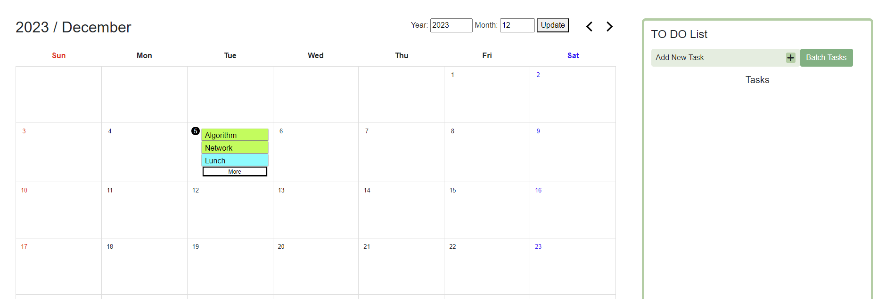
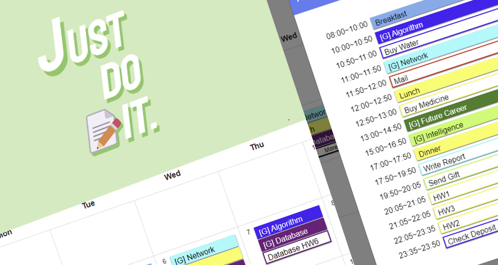

# 📝 JUST DO IT

 

Schedule automatic placement calendar that allows you to manage schedules and to-do tasks in chronological order. Instead of thinking about what to do, let's actually solve it in time! That's why we named this project "JUST DO IT".

The page was implemented using bootstrap and JavaScript. The service is available locally in [https://r3j0.github.io/JustDoIt](https://r3j0.github.io/JustDoIt). 

## Repository
- index.html
- js/calendar.js : JavaScript file for calendar features.
- js/todolist.js : JavaScript file for todolist features.
- js/assignTask.js : JavaScript file that includes the ability to automatically place things to do.

## Usage
 
- You can add a schedule on that date by pressing the date button on the calendar.
- You can add a to-do by pressing the "Add New Task" button on to-do list.
- To place unassigned to-do lists on the calendar, press the Batch button to automatically place the to-do list in the remaining time in order of priority.

## Contributors
 

Gachon University - Department of Software

2023-2 Algorithm (14465_001) Team 1

- [Park Jeonggeun (r3j0)](https://github.com/r3j0)
  - Implementation of key calendar features and handling errors, write assignTask.js 
- [Lee Minwoo (Minminminwoo)](https://github.com/Minminminwoo)
  - Implementation of to-do list basic framework and key to-do list features
- [Han Seungwoo (shy-a11y)](https://github.com/shy-a11y)
  - Implementation of calendar basic framework and key calendar features
- [Go Minjeong (rhalswjd)](https://github.com/rhalswjd)
  - Implementation of to-do list features and project planning